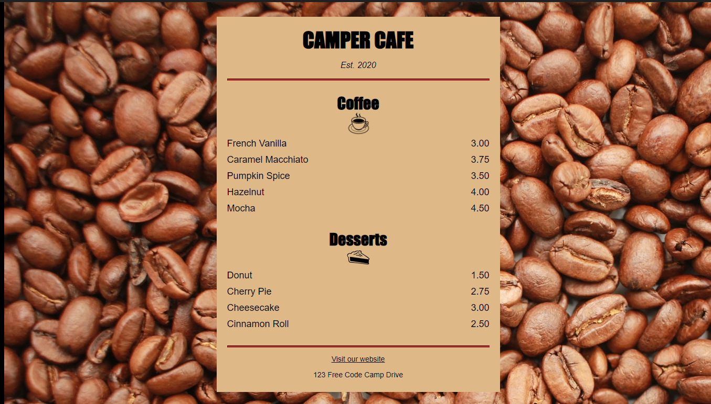

## Basic CSS
---
CSS example from [freeCodeCamp](https://www.freecodecamp.org/learn/2022/responsive-web-design/)

In this course, we learned how to enhance the appearance of our webpage using CSS. We covered all the fundamental features of CSS, such as setting the color, font, size, and other aspects of HTML elements.

Front Page
---

This project was created following the [freeCodeCamp lesson](https://www.freecodecamp.org/learn/2022/responsive-web-design/) on responsive web design  for educational purposes only.